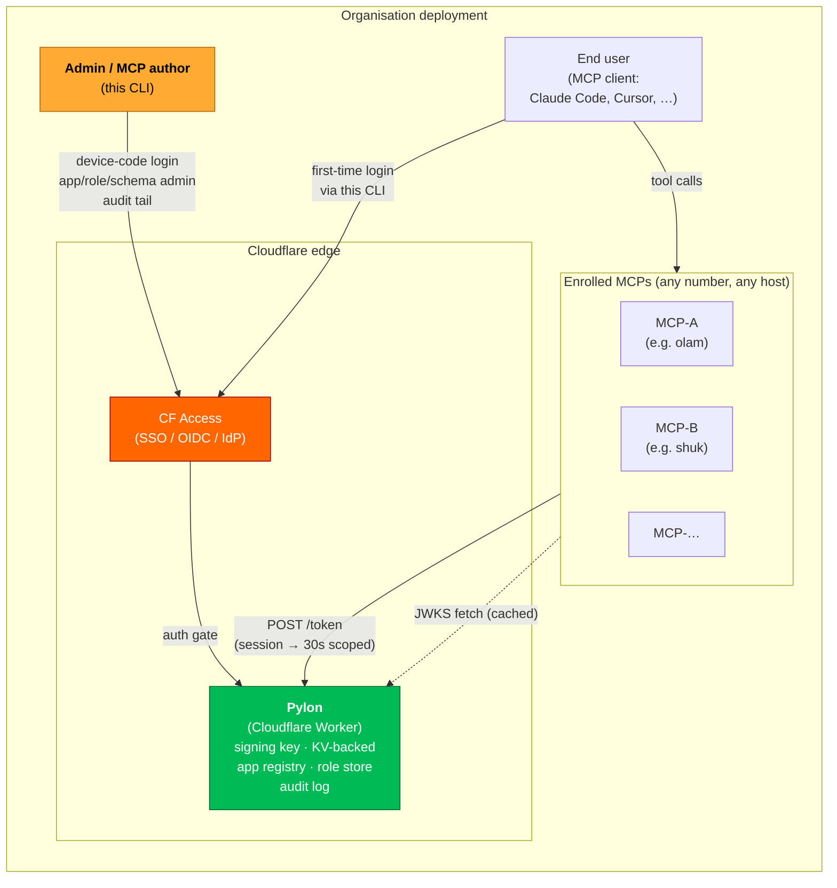
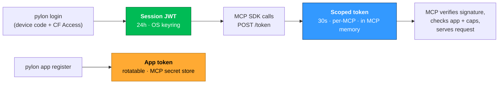
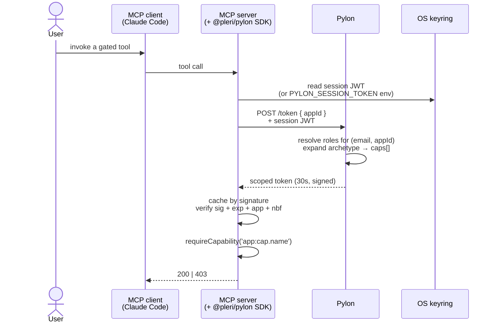
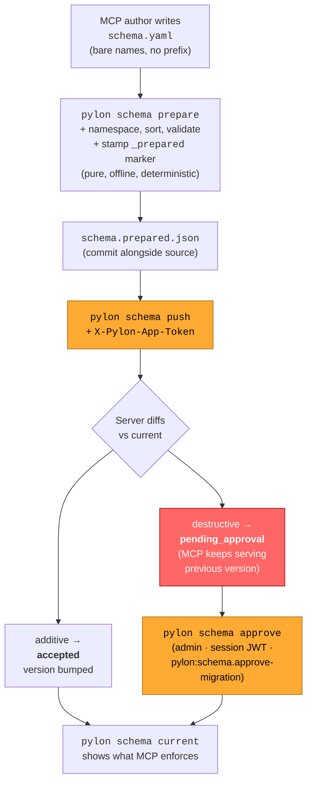

# `@pleri/pylon-cli`

> Operator + admin command-line for the **Pylon** authorization platform.
> Log in once, manage apps and roles, push capability schemas, tail
> the audit log.

[](https://www.npmjs.com/package/@pleri/pylon-cli)
[](https://docs.npmjs.com/generating-provenance-statements)
[](LICENSE)

---

## What is this?

**Pylon** is a centralised RBAC + identity service for an organisation's
MCP servers. One Pylon per org. Every MCP that needs authz delegates
to it instead of running its own role store, login flow, and audit
log.

`@pleri/pylon-cli` (the `pylon` binary) is the **human-facing surface**
of that platform. It does three jobs:

1. **Authenticate you to your org's Pylon** (device-code flow → CF Access SSO → session JWT in the OS keyring).
2. **Administer the platform** — register apps, grant/revoke roles, tail audit, approve destructive schema migrations.
3. **Author MCP capability schemas** — `pylon schema prepare` + `pylon schema push` deliver the authoritative list of capabilities + archetypes that an MCP enforces.

This CLI talks to a Pylon service over plain HTTP. The Pylon service
itself is a closed implementation today; the wire contract this CLI
implements is documented in
[`docs/PYLON_SDK_CONTRACT.md`](docs/PYLON_SDK_CONTRACT.md).

## How the pieces fit



**Where each piece sits:**

| Piece | Role | Where it runs |
|---|---|---|
| **CF Access** | First-factor authentication. Owns "is this a real human in the org?" | Cloudflare edge, in front of the Pylon Worker |
| **Pylon (Worker)** | RBAC authority. Mints session JWTs and short-lived (30s) scoped tokens. Owns the app registry, role grants, schema versions, audit log. | Cloudflare Worker + KV (one deployment per org) |
| **MCPs** | Whatever business logic the org cares about (worlds, marketplaces, jobs). Each enrols into Pylon, declares a capability schema, and validates scoped tokens on every request. | Anywhere — CF Workers, stdio, Node servers |
| **`pylon` CLI (this repo)** | Admin + MCP-author entry point. Logs in, registers apps, grants roles, pushes schemas, tails audit. | Your laptop / your CI runner |
| **MCP clients** (Claude Code, Cursor, …) | End-user surface. Calls MCPs; never talks to Pylon directly. | End-user machine |

CF Access only fronts **Pylon**. MCPs are public endpoints that refuse
any request lacking a cryptographically-valid Pylon scoped token —
the security boundary shifts from "is this on the VPN" to "does this
carry a token signed by our Pylon."

## The three credentials



| Credential | TTL | Held by | Purpose |
|---|---|---|---|
| **Session JWT** | 24h | OS keyring (CLI) or `PYLON_SESSION_TOKEN` env (headless / MCP runtimes) | The user-identity tier. One per `(org, machine)`. Shared across all MCPs in that org — log in once, every MCP can mint scoped tokens off it. |
| **App token** | Rotatable | MCP secret manager (`wrangler secret put PYLON_APP_TOKEN`) | The MCP-identity tier. Proves "I am the `olam` app" when pushing schema. Returned **once** by `pylon app register`. |
| **Scoped token** | 30s | MCP process memory | Per-request authz. Contains `(orgId, appId, caps[])`. MCP verifies signature locally — zero per-request network calls to Pylon on cache hit. |

Revocation is therefore worst-case 30s late, in exchange for zero
hot-path I/O. That tradeoff is the load-bearing design choice.

## Per-request flow (where the CLI doesn't appear)

This is the path that runs on every actual MCP tool call. The CLI isn't
in it — it's the **deploy-time / admin-time** surface that produces the
state this flow consumes.



The next call reuses the cached scoped token (zero I/O until it expires).
JWKS is fetched once at MCP boot and refreshed stale-while-revalidate.

## Schema lifecycle (where the CLI is the engine)

Each MCP declares its capabilities + archetypes (named bundles like
`user`, `admin`) as a schema. The CLI prepares + pushes that schema
to Pylon; Pylon versions it; the MCP serves against the current
version.



The split between `prepare` and `push` (ADR 006) exists so the prepared
artifact can be committed and code-reviewed lockfile-style — and so
the CLI can validate before bytes ever leave the laptop. Destructive
diffs **never auto-apply**; the previous version keeps serving until
an admin approves, which is the system's single most important
operational guardrail.

## Install

```bash
npm install -g @pleri/pylon-cli
pylon --version
```

Or one-shot via `npx`:

```bash
# Replace the URL with your org's actual Pylon endpoint:
npx -p @pleri/pylon-cli pylon login --org-url=https://pylon.example.com
```

For local development from this repo:

```bash
pnpm install
pnpm build
pnpm test
pnpm exec pylon <command>
```

## Quick start

```bash
# 1. Log in to your org's Pylon (device-code flow → CF Access SSO):
pylon login --org-url=https://pylon.example.com   # ← your org's URL
# → opens a browser tab; enter the one-time code; press enter.
#   session JWT lands in your OS keyring (24h TTL).

# 2. Confirm:
pylon whoami

# 3. (Admin) Register a new MCP — returns a one-time app token:
pylon app register --name=olam --owner=engineer@acme.com
# → save PYLON_APP_TOKEN immediately; it is NOT retrievable later.

# 4. (Admin) Grant a role:
pylon role grant --email=alice@acme.com --app=olam --archetype=admin

# 5. (MCP author) Push a capability schema:
pylon schema prepare --source schema.yaml --app olam --out schema.prepared.json
PYLON_APP_TOKEN=pyat_... pylon schema push --app olam --file schema.prepared.json

# 6. (Admin) Audit:
pylon audit tail --action=role.granted
```

The full command reference — every subcommand, every flag, every
exit code — is in [`docs/CLI.md`](docs/CLI.md).

## Documentation

| Doc | What's in it |
|---|---|
| [`docs/CLI.md`](docs/CLI.md) | Command reference, exit codes, worked examples |
| [`docs/ROUTES.md`](docs/ROUTES.md) | Per-endpoint route classes (public / Pylon-authenticated / browser-gated), CF Access configuration recipes, gateway-intercept troubleshooting |
| [`docs/PYLON_SDK_CONTRACT.md`](docs/PYLON_SDK_CONTRACT.md) | Wire-level contract this CLI implements (HTTP/JSON shapes, auth flow, schema push semantics) |
| [`docs/adr/003-cli-login-state-machine.md`](docs/adr/003-cli-login-state-machine.md) | Device-code login state machine, identity primacy, library choices |
| [`docs/adr/004-trust-boundary.md`](docs/adr/004-trust-boundary.md) | Trust boundary for `orgId`; cache-vs-discovery resolution; `pylon forget` recovery path |
| [`docs/adr/006-schema-prepare.md`](docs/adr/006-schema-prepare.md) | Why `schema push` was split into `prepare` + `push` (CLI UX + provenance, not protocol boundary) |
| [`CHANGELOG.md`](CHANGELOG.md) | Per-version changes, migration playbooks |

## Releases

Releases are tagged with `v<semver>` (e.g. `v0.3.0`, `v0.3.1`,
`v0.4.0`). Pushing a tag triggers the publish workflow at
`.github/workflows/publish.yml`, which publishes to npm via the
[Trusted Publisher OIDC flow](https://docs.npmjs.com/trusted-publishers) —
provenance attestation visible on the npm package page.

The maintainer's release procedure is documented in `CHANGELOG.md`
above each version's entry; the runbook is to bump `version` in
`package.json`, update `CHANGELOG.md`, merge to `main`, then tag
`v<semver>` at the merge commit and push the tag.

## Issues + contributions

[Open an issue](https://github.com/pleri/pylon-cli/issues) for bugs in
the CLI or this repo's docs. Issues about the Pylon service itself
(server bugs, auth failures, deploy questions) are handled out-of-band
by the service team.

Contributions welcome — fork, branch, PR. The repo follows
Conventional Commits; CI runs `pnpm build && pnpm test`.

## Provenance + lineage

Every published version carries an [npm provenance attestation](https://docs.npmjs.com/generating-provenance-statements) signed by Sigstore. To verify the bundle for a specific version:

```bash
# Fetch the attestation bundle from the npm registry:
curl https://registry.npmjs.org/-/npm/v1/attestations/@pleri%2fpylon-cli@0.3.0

# Or look up the sigstore transparency-log entry directly:
# https://search.sigstore.dev/?logIndex=1390906936  (0.3.0)
```

`gh attestation verify` may return 404 against this package depending on which GitHub-side endpoint it queries. The npm registry attestation URL above is the canonical fallback — it returns the SLSA provenance bundle and the npm publish attestation as inline JSON.

This package was previously published from a closed-source monorepo (`pleri/pylon`, internal). Versions `0.1.0`, `0.1.1`, `0.1.2` shipped from there without provenance. From `0.3.0` onwards, all releases come from this repo with provenance attestation; `0.2.x` was intentionally skipped to signal the boundary. See [ADR 006](docs/adr/006-schema-prepare.md) for the framing rationale.

## License

[MIT](LICENSE) © Ernie Sim
