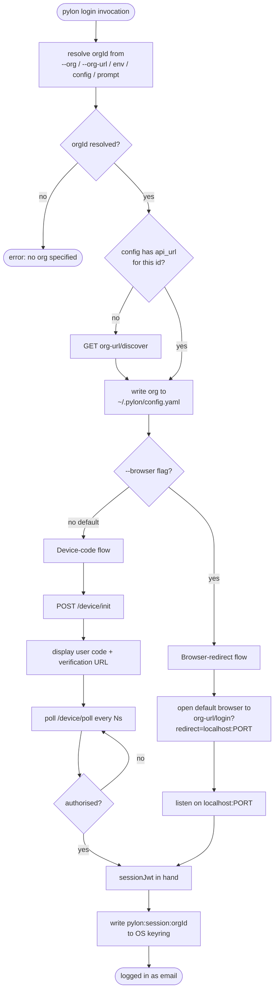

# ADR 003 — CLI login state machine, identity primacy, library choices

**Date:** 2026-04-23
**Status:** accepted
**Deciders:** CTO
**Supersedes:** none
**Superseded by:** none
**Related:** ADRs 001 ("Pylon as a service") and 002 ("token storage and sharing") live in the closed-source Pylon service repo and aren't reproduced here; the relevant context is summarized inline below.

## Context

ADR 002 committed to "session in OS keyring, scoped tokens in
memory, SDK-in-MCP." It did not settle three implementation forks
that the CLI design surfaces:

1. **Identity primacy.** Is an org identified by its URL (one place
   to reach it) or by a stable id (short slug users type)?
2. **Login input precedence.** Users can arrive with `--org=<id>`,
   `--org-url=<url>`, env vars, or a config file. What wins?
3. **Library choices.** Which CLI framework and which keyring
   binding?

Settling these before code keeps us from encoding transport details
into persisted state (URLs age badly) and from scattering
inconsistent flag conventions across later commands.

## Decision

### Identity — org-id is primary, URL is a locator

Every org has a stable `orgId` (short slug, e.g. `company`,
`company-staging`). The `orgId` is admin-defined at Pylon deploy
time via a wrangler env var (`PYLON_ORG_ID`) and published through a
`/discover` endpoint:

```json
GET <org-url>/discover
→ { "id": "company", "name": "Company Inc", "api_url": "https://pylon.company.internal" }
```

The CLI, the SDK, and the keyring all key on `orgId`. URLs change
(domain migrations, renames, staging vs prod) without invalidating
anyone's session.

### Login input precedence (first match wins)

```
1. --org=<id>            explicit slug
2. --org-url=<url>       explicit URL → resolve to id via /discover
3. PYLON_ORG_ID env      headless
4. PYLON_ORG_URL env     headless, resolve via /discover
5. config default_org    from ~/.pylon/config.yaml
6. Interactive prompt    "which org?" (lists known orgs from config)

Missing for all of 1-6 and non-interactive → error with help text.
```

### Persisted state

Two distinct stores with different lifetimes:

| Store | Contents | Lifetime |
|-------|----------|----------|
| OS keyring `pylon:session:<orgId>` | session JWT | 24h (token TTL) |
| `~/.pylon/config.yaml` | org metadata (id, api_url, aliases, default_org) | permanent |

Config file is shareable across a team (committable in dotfiles if
desired). Keyring is per-user-per-machine and never committed.

```yaml
# ~/.pylon/config.yaml — example
default_org: company
orgs:
  - id: company
    api_url: https://pylon.company.internal
    aliases: [company.pylon.cloud]
    default: true
  - id: company-staging
    api_url: https://pylon-staging.company.internal
```

### CLI framework — `commander`

Standard, MIT-licensed, 60M+ weekly downloads, stable API since
v11. Rejected alternatives:

- **`yargs`**: richer parsing, larger API surface, heavier install.
  We don't need the complexity.
- **`citty`** (Nuxt/UnJS): modern, tiny, good DX. Too new for a
  long-running auth tool; we want boring deps.
- **Hand-rolled**: no.

### Keyring — `@napi-rs/keyring`

Rust-backed, actively maintained (Napi-RS team), cross-platform
(macOS Keychain, Windows Credential Manager, Linux Secret Service),
MIT-licensed. Rejected alternatives:

- **`keytar`**: de-facto standard but effectively abandoned since
  2023. Known native-binding breakage on newer Node versions.
- **Platform-specific adapters**: too much per-OS surface area for
  no real win.

## Forces

**Identity primacy.** URLs are transport, not identity. Coupling
persisted state to URLs means every domain change (internal rename,
provider migration, Let's Encrypt/ACM cert swap on a custom host)
cascades into keyring invalidation and user re-login. Slugs are
stable.

**Precedence order.** CLI flags must beat env vars (they're more
explicit). Env vars must beat config (they're more dynamic). Config
must beat interactive prompts (they're the "set it and forget it"
layer). This ordering is standard across every major CLI (gh, aws,
gcloud).

**No interactive prompts in headless contexts.** The CLI detects
non-TTY (`!process.stdin.isTTY`) and refuses to prompt, returning a
structured error instead. This keeps CI safe.

**Keyring fallback.** Not every environment has a keyring (CI,
Docker, WSL without gnome-keyring). Every command falls back to
`PYLON_SESSION_TOKEN` env var. The fallback is explicit: if neither
keyring nor env var has a session, commands fail with an actionable
error.

## Login state machine (detailed)



### Error paths and their exit codes

| Scenario | Exit | Message |
|----------|------|---------|
| No org resolved, TTY | 2 | prompt-time UX; shouldn't hit this |
| No org resolved, non-TTY | 2 | "set PYLON_ORG_ID or pass --org" |
| `/discover` returns 404 | 3 | "no Pylon reachable at `<url>`" |
| Device-code polling times out | 4 | "device authorisation expired" |
| Keyring write fails (e.g. locked) | 5 | "could not store session; try unlocking your keyring" |
| Non-200 from `/device/poll` unexpectedly | 6 | "Pylon returned an error: `<message>`" |

## SDK resolution (mirror for runtime)

MCPs don't run `pylon login`; they consume the session it produced.
The SDK uses the same precedence order, minus the CLI-specific
steps:

```
1. PYLON_ORG_ID env      → lookup in config.orgs; fail if absent
2. PYLON_ORG_URL env     → match against config.orgs[].api_url / aliases
3. config.default_org    → use it
4. Error with missingSessionError template

After orgId is resolved:
1. PYLON_SESSION_TOKEN env → use directly (headless override)
2. OS keyring pylon:session:<orgId> → read
3. Both absent → missingSessionError
```

## Library choices — version pins

- `commander@^12` — major v12 stabilised the ESM story
- `@napi-rs/keyring@^1` — current stable
- `yaml@^2` — standard YAML parser (same one Olam uses)
- `@inquirer/prompts@^5` — interactive prompts only in TTY paths
- `open@^10` — cross-platform browser launcher for `--browser` flow

Dev:
- `vitest@^3` — matches the workspace's test runner
- `@types/node@^22`

## Consequences

### Positive

- **Stable identity.** `orgId` survives every URL change the
  infrastructure will eventually throw at us.
- **Multi-org clean.** `pylon use --org=<id>` to switch; every
  command accepts `--org=<id>` as override. Keyring holds all
  sessions concurrently.
- **Standard UX.** Matches `gh`, `aws`, `gcloud` precedence rules.
  Users with prior CLI experience feel at home.
- **Stable library set.** Five non-dev deps, all MIT, all actively
  maintained.

### Negative

- **`--org-url` still exists as an escape hatch.** Some users will
  learn it first (admin just handed them a URL) and habituate to it.
  We mitigate by making `--org` equally discoverable and treating
  `--org-url` as a first-contact convenience that auto-saves the
  resolved `orgId`.
- **`/discover` endpoint is new service surface.** Adds one small
  handler to Pylon's service API. Low cost.
- **Keyring dependency.** Users in environments without OS keyring
  (some CI shapes, headless Linux) must use `PYLON_SESSION_TOKEN`.
  Documented explicitly; not a silent failure.

## Implementation note

This ADR's decisions land in code as:

- `src/commands/login.ts` — implements the state machine
- `src/config.ts` — reads/writes `~/.pylon/config.yaml`
- `src/keyring.ts` — wraps `@napi-rs/keyring` with env
  var fallback
- `src/http.ts` — Pylon HTTP client; includes `/discover`
- The Pylon service (closed-source) — serves `/discover`,
  `/device/init`, `/device/poll`, `/login`, `/token`, `/whoami`

The CLI can be implemented and unit-tested before the service is
written; integration tests wait for the service PR.
